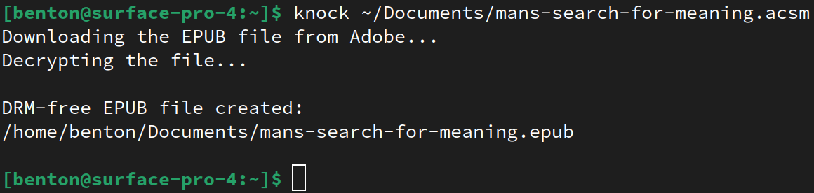

# Knock

Convert ACSM files to DRM-free EPUB files using one command.



This software does not utilize Adobe Digital Editions nor Wine. It is completely free and open-source software written natively for Linux.

## Setup and Installation

1. Create a free Adobe account [here](https://account.adobe.com) if you do not already have one.
1. Install the software.
    * For NixOS, include this flake in your system `flake.nix`. Then run `knock ~/path/to/my-book.acsm` to use.
        ```nix
        inputs.knock.url = github:BentonEdmondson/knock
        outputs = { self, knock }: { /* knock.defaultPackage.x86_64-linux is the package */ }
        ```
    * For non-NixOS, use the latest [release](https://github.com/BentonEdmondson/knock/releases). It is large because it includes all dependencies, allowing it to run on any system with an x86_64 Linux kernel. It was built using [`nix bundle`](https://nixos.org/manual/nix/unstable/command-ref/new-cli/nix3-bundle.html). Use it by doing the following:
        1. Download `knock-version-x8664-linux` and open a terminal
        1. Navigate to the folder within which `knock-version-x86_64-linux` resides (e.g. `cd ~/Downloads`)
        1. Run `mv knock-version-x86_64-linux knock` to rename it to `knock`
        1. Run `chmod +x knock` to make it executable
        1. Run `./knock ~/path/to/my-book.acsm` to convert the ebook

            If you receive an error that says something like `./nix/store/...: not found` or `./nix/store/...: No such file or directory` then you might not have user namespaces enabled. Try running the following to fix it:

            ```
            echo "kernel.unprivileged_userns_clone=1" >> /etc/sysctl.conf
            sudo reboot
            ```

        1. Enter in your Adobe email and password when prompted
        1. Optionally move the executable to `~/bin` (for your user) or `/usr/local/bin/` (for all users) to allow it to run from anywhere (might not work on some distributions)


## Verified Book Sources

Knock should work on any ACSM file, but it has been specifically verified to work on ACSM EPUB files from the following:

* [eBooks.com](https://www.ebooks.com/en-us/)
* [Rakuten Kobo](https://www.kobo.com/us/en)
* [Google Books](https://books.google.com/)
* [Hugendubel.de](https://www.hugendubel.de/de/) (German)

The resulting EPUB file can be read with any EPUB reader.

## Legality

[It's Perfectly Legal to Tell People How to Remove DRM](https://gizmodo.com/its-perfectly-legal-to-tell-people-how-to-remove-drm-1670223538) (Gizmodo)

**Do not use this software for piracy; this software is not intended for piracy.** This software exists to allow readers to *legally* purchase and then legally and *freely* read ebooks. I suspect that the significant prevalence of ebook piracy is caused in large part by the restrictions put on legally purchased ebooks. This software exists to *incentivize* the legal purchase of ebooks by enabling their unrestricted and legal consumption.

## The Name

The name comes from the [D&D 5e spell](https://roll20.net/compendium/dnd5e/Knock#content) for freeing locked items:

> ### Knock
> *2nd level transmutation*\
> **Casting Time**: 1 action\
> **Range**: 60 feet\
> **Components**: V\
> **Duration**: Instantaneous\
> **Classes**: Bard, Sorcerer, Wizard\
> Choose an object that you can see within range. The object can be a door, a box, a chest, a set of manacles, a padlock, or another object that contains a mundane or magical means that prevents access. A target that is held shut by a mundane lock or that is stuck or barred becomes unlocked, unstuck, or unbarred. If the object has multiple locks, only one of them is unlocked. If you choose a target that is held shut with arcane lock, that spell is suppressed for 10 minutes, during which time the target can be opened and shut normally. When you cast the spell, a loud knock, audible from as far away as 300 feet, emanates from the target object.

## Dependencies

* [`libgourou-utils`](https://github.com/BentonEdmondson/libgourou-utils) for using the ACSM file to download the corresponding encrypted EPUB file from Adobe's servers
* [`inept-epub`](https://github.com/BentonEdmondson/inept-epub/) for decrypting the EPUB file

These are already included in all releases and in the Nix flake of course.

## License

This software is licensed under GPLv3 because one of its dependencies is licensed under GPLv3.
